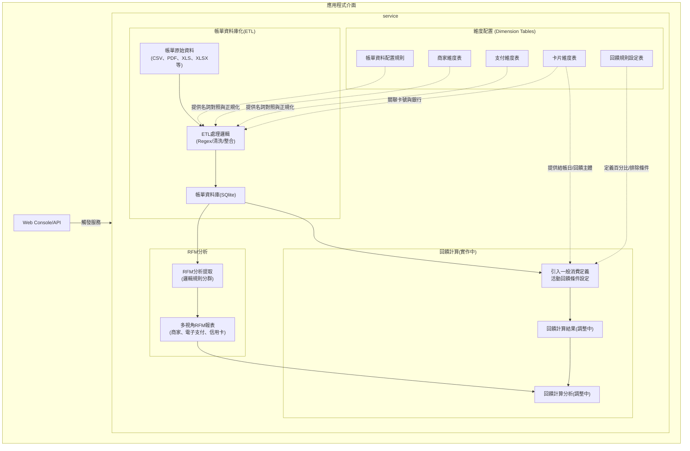

# 💳 Credit Card Transaction ETL Pipeline

> **Automated Financial Data Engineering**
> *From "Garbage In" to "Actionable Insights" — A Privacy-First Approach.*
> *從雜亂帳單到精準決策：一個隱私優先的自動化資料管線。*


## 📖 專案背景 (Project Context)
1. 從手動紀錄到系統化分析的演進
    本專案的核心起源於對個人消費行為的「高解析度」追求。起初為了梳理消費習慣而申辦信用卡，並密切關注回饋機制。我的第一張卡主打現金回饋，需符合特定條件折抵帳單，因此我開始使用 Excel 手動核對。

    大約半年後，我申辦了第二張點數回饋卡。由於其入帳更即時且情境不同，我進一步在 Excel 中加入了點數與現金的效益比較。隨著消費情境細化，我陸續配置了「保費」與「外幣」專屬卡片，並透過追蹤登錄活動來最大化回饋。然而，隨著卡片配置從單一轉向多卡組合，手動維護的邊際成本開始劇增，這段歷程也成為我開發自動化數據管線（Pipeline）的核心契機。

2. 面臨的挑戰與痛點
在嘗試將上述手動優化邏輯自動化的過程中，我發現跨銀行帳單整合不僅是格式問題，更面臨了數據主導權與隱私安全的多重挑戰：

*   Data Consistency (數據一致性): 支付通路或商家名稱會因商業行為或法規變更而異，導致消費明細格式多樣、極難歸一化。

*   Scalability (擴充性瓶頸): 隨著卡片張數增加與回饋規則變動，觀察商家狀態、校對回饋以及資料儲存的時間成本呈幾何級數增長，Excel 公式已難以負荷複雜的邏輯。

*   Contextual Limitation (情境解析限制): 市面上的雲端記帳軟體使用一般分類邏輯，無法還原個人的「真實消費情境」。若過度依賴外部工具進行分類，將失去對消費行為的深度解析能力，進而阻礙後續的回饋最佳化與消費方向改善。

*   Privacy Risks (隱私安全風險): 將高度敏感的財務與消費數據上傳至第三方伺服器，即使已有強大的雲端 LLM (大型語言模型) API 可用於解析非結構化帳單，仍存在極大的隱私外洩疑慮。

3. 解決方案
基於上述痛點，本專案構建了一個 Local-First ETL Pipeline，堅持掌握數據主導權：

*   Zero-Cloud Logic: 所有原始 CSV 帳單解析、資料清洗與 SQLite 資料庫儲存均在本地端獨立完成，阻絕外部 API 風險。

*   Rule Segregation: 藉由獨立模組將包含個人資訊的邏輯進行脫敏處理與通用代碼分離，確保專案能安全地展示於公開的 GitHub 儲存庫。

透過此架構，系統不僅能支援後續的 RFM 模型 與 回饋最佳化 分析，更實現了從手動比對到數據驅動決策的轉型。

---

## 🚀 快速上手 (Quick Start)

   1. **環境設定**：`pip install -r requirements.txt`
   2. **準備資料**：將銀行 CSV 帳單明細匯出後，放入 `data/` 資料夾。
   3. **啟動分析介面**：`python -m api.server` (訪問 http://localhost:5000)
   4. **執行 ETL**：透過 Web 介面點擊執行，或手動執行 `python main.py`。

---

### 系統架構與資料流程 (System Architecture)
    本專案採用服務化架構 (Service-Oriented Architecture)，透過 ETL流程將原始帳單轉換為結構化資料，並結合維度配置進行 RFM 分析與回饋計算。



   * 

   1. Extract (提取)：main.py 掃描 data/ 資料夾，利用 get_parser 自動識別銀行，透過 parsers/ 將 PDF/CSV 轉為一致的 STANDARD_COLUMNS 格式。
   2. Transform (清洗)：
       * classifier.py 根據 configs/ 中的規則自動判斷交易類型。
       * 移除支付前綴（如 LINEPAY*），還原乾淨的商家名稱以利後續分析。
   3. Load (寫入)：
       * sqlite_loader.py 將乾淨的交易紀錄寫入 output/Bills.db。
       * config_loader.py 將公開設定和私人設定依據資料載入規則，採取附加模式或取代模式寫入各階段需要引用設定的規則。
   4. Analyze (分析)：analytics/ 模組讀取資料庫，產出：
       * 商家 RFM：哪些店是你最常去且花最多的？
       * 信用卡 RFM：哪張卡是你的主力消費卡？
       * 消費矩陣：視覺化不同時間維度的消費分佈。
       * 回饋計算：計算卡片回饋，並計算C/P值和消費難易度分析。

---

## 🛠️ 開發方法論 (Development Methodology)

本專案採用 **AI 輔助開發 (AI-Assisted Development)** 模式，結合人類架構師的邏輯與 LLM 的算力。

* **Architecture (人類主導):** 定義資料流 (Data Flow)、Schema 設計、隱私邊界與商業目標。
* **Implementation (AI 加速):** 本專案使用Gemini Pro模型生成 Pandas 語法，整理繁瑣的 Regex 規則和形成解析器樣板，大幅提升開發效率。
* **Verification (嚴格審查):** 所有生成代碼皆經過 Code Review，並通過真實數據的邏輯校驗（A/B Testing），確保前後產出一致性；同時嚴格規範變數命名，維持代碼庫的穩定與可讀性。

---

## 📂 檔案結構 (File Structure)

```text
.
My-Credit-Card-ETL/
│
├── .gitignore                  #
├── README.md                   # 介紹文件
├── requirements.txt            # [環境] 專案相依套件清單
├── main.py                     # [入口點] 核心 ETL 流程控制器
├── const.py                    # [規範] 全域欄位定義與資料型態 (Single Source of Truth)
│   
├── api/
│   └── server.py               # [本機端伺服器] 
│  
├── parsers/                    # [解析層] 負責各銀行原始帳單轉為標準 DataFrame
│   ├── base.py                 # Parser 基類，定義統一介面
│   ├── cathay.py               # 國泰世華 (csv) 解析邏輯
│   ├── esun.py                 # 玉山銀行 (csv) 解析邏輯
│   ├── CTBC.py                 # 中國信託 (csv) 解析邏輯
│   ├── sinopac.py              # 永豐銀行 (PDF) 解析邏輯
│   └── hncb.py                 # 華南銀行 (格式偽裝) 解析邏輯
│
├── processors/                 # [處理層] 負責資料清洗、分類與商家對齊
│   ├── refiner.py              # 清洗總指揮，協調各子處理器
│   ├── classifier.py           # 自動標記交易類別 (一般、國外、退刷、繳款)
│   ├── merchant.py             # 商家名稱清洗與正規化
│   └── mapper.py               # 欄位對應處理
│
├── loaders/                    # [載入層] 負責資料儲存、載入設定檔資料
│   ├──schema_enforcer.py       # 匯入型別規則已確認資料型態是否指定，阻止針對資料型態的預測
│   ├──sqlite_loader.py         # 將清洗後的資料匯入 SQLite (Bills.db) 
│   └──config_loader.py         # 將相關的設定資料匯入主程式執行
│
├── analytics/                  # [分析層] 負責進階數據建模
│   ├── run_rfm.py              # RFM 分析執行腳本
│   ├── rfm_modules.py          # RFM 計算引擎 (Merchant/Payment/Card)
│   └── run_rewards.py          # 回饋金計算執行腳本
│
├── configs/                        # [設定檔資料夾] 
│   ├── dim_cards.csv                   # [設定檔] 真實卡號放置地點(已提供可直接讀取的範例檔)
│   ├── transaction_types.yaml          # [設定檔] 銀行交易類別，排除持卡人跟銀行的交易像繳款、折抵/回饋、費用(手續費/服務費)(公開)
│   ├── dim_merchants.csv               # [設定檔] 真實交易地點，使用Regex(正則表達式)-Replacement來清洗消費明細(部分公開)
│   ├── dim_payment_gateway.csv         # [設定檔] 電子支付平台，使用Regex(正則表達式)-Replacement來整理支付通路(公開)
│   ├── dim_card_rewards_base.csv       # [設定檔] 基本回饋設定(已在 .gitignore )
│   ├── dim_card_rewards_campaigns.csv  # [設定檔] 消費活動回饋設定(已在 .gitignore)
│   ├── bridge_reward_rules.csv         # [設定檔] 基本回饋設定橋接表(已在 .gitignore)
│   └── bridge_cube_selections.csv      # [設定檔] Cube權益切換橋接表(已在 .gitignore)
│
├── data/                       # [帳單csv放置處] 真實的 CSV 帳單放這邊。
│   └── (各銀行帳單)
└── output/                     # [輸出區] 存放 Bills.db 與 分析報表 (已在 .gitignore)

```
附註：
實際使用的資料依據config_loader.py設定的讀取狀態來處理資料。
dim_cards.csv可作為樣板自行修改。
dim_merchants.csv直接更新在欄位下方就好。


---

## 🚀 未來演進與重構計畫 (Future Roadmap)
隨著管線支援的銀行與信用卡數量增加，初期的「分散式維度設定檔」（將帳單解析規則、卡片資訊、回饋條件分別存放）已逐漸產生維護上的冗餘。為此，下一階段的系統架構將進行以下重構：

*   維度配置集中化 (Configuration Consolidation)：
    *   將原本散落的「帳單資料配置規則」、「卡片維度表」與「回饋規則設定表」整併為統一的 「銀行設定資料庫 (Bank Configuration DB)」。
    *   「商家維度表」和「支付維度」整合進同一個資料庫環境。

*   提升擴充效率：
        透過統一的資料庫關聯，未來新增銀行或卡片時，可實現單一入口 (Single Point of Entry) 的設定，大幅降低設定檔維護的時間成本，並確保 ETL 處理與回饋計算引擎提取參數時的一致性。

*   瀑布式回饋引擎調整：
    *   回饋適用順序跟計算


### 支援銀行擴充
- [x] **玉山銀行**：已完整支援 (含 e.Point 折抵處理、多卡號歸戶邏輯)
- [x] **國泰世華**：已完整支援 (含 Cube 卡多卡號歸戶邏輯)
- [x] **中國信託**：已完整支援 
- [x] **華南銀行**：已完整支援 (含 副檔名偽裝、多卡號歸戶邏輯)
- [X] **永豐銀行**：已完整支援
- [ ] **台新銀行**：徵求 CSV 格式樣本 (Help Wanted)
- [ ] **台北富邦**：徵求 CSV 格式樣本 (Help Wanted)

## 📅 開發日記 (Dev Log)

* **2026-04-25**
   * 更新全域變數宣告型態，預處理資料架構調整。

* **2026-04-15**
   * 回饋計算流程更新成瀑布式回饋引擎，依序計算特殊活動加碼回饋→一般消費定義排除→一般消費活動加碼回饋→一般消費。細部修正中。
   * Merchant_Display SSOT：將清洗後的資料明細作為後續RFM分析跟回饋計算分析的SSOT。

* **2026-03-27**
   * 回饋計算流程建立，內容設定調整中
   * 資料型態定義法律化：定義輸入輸出的資料型態，解決資料型態衝突報錯的問題。
   * 帳單月份標籤實作：透過帳單資訊產生帳單月標籤定位回饋原始資料，降低維護成本。

* **2026-03-21**
   * 專案架構調整，新增前端頁面以便傳送請求
   * 僅使用本機端，不連網以符合個人使用情境

* **2026-03-12**
   * 行為準則建立：完成 GEMINI.md，定義編碼規範、架構完整性保護，以及最核心的「核心變更驗證規範 (Refactoring Protocol)」。
   * 配置載入器實作：建立 loaders/config_loader.py，支援多重編碼嘗試 (UTF-8 → Big5 → cp950) 與 Append/Replace 讀取策略。
   * 核心架構解耦：
       * 重構 main.py：將設定檔讀取邏輯從處理器移至進入點。
       * 重構 processors/ (merchant.py, classifier.py, refiner.py)：改為注入式規則架構，不再內部讀檔。
   * 穩定性驗證：透過 A/B 測試比對 result_old.csv 與 result_new.csv，確認重構前後處理結果 100% 完全一致。

* **2026-03-07**
    * 專案架構調整，並同步整理檔案命名 (parser資料夾，和資料夾內的所有檔名) 。
    * 分散parser，從一條線處理轉成依據各銀行帳單格式進行模組呼叫。
    * 開始撰寫回饋計算邏輯

* **2026-02-07**
    * 撤下 Mock Data Generator (generate_mock.py) 與隱私分流架構 (Himitsu.py)。
    * 重構專案檔案命名 (merchants.csv, payment_gateway.csv) 以符合工程慣例。
    * RFM記錄邏輯上傳。
    * 支付規則(Regex)上傳，整理商家規則(Regex)中。
    * 更新Git歷史紀錄

* **2026-02-02**
    * 建立 Mock Data Generator (generate_mock.py) 與隱私分流架構 (Himitsu.py)。
    * 開始分離EXCEL回饋紀錄邏輯跟跟RFM紀錄邏輯

* **2026-02-01**
    * 完成 `refine.py` 第一版。

* **2026-01-28**
    * 重構了 `refine.py` 的邏輯。遇到一個 Bug：有些卡號末四碼會重複，後來決定加入「卡片名稱」作為第二鍵值來解決。
    * 新增了國泰 Cube 卡的雙號自動歸戶功能。
    * 消費明細關鍵字表(Regex)定稿

* **2026-01-20**
    * 專案初始化。完成第一版 ETL 架構 (`etl.py`)。
    * 變更資料流處理模式，從原本寫在Excel的回饋相關資料跟RFM關資料開始形成專案。

