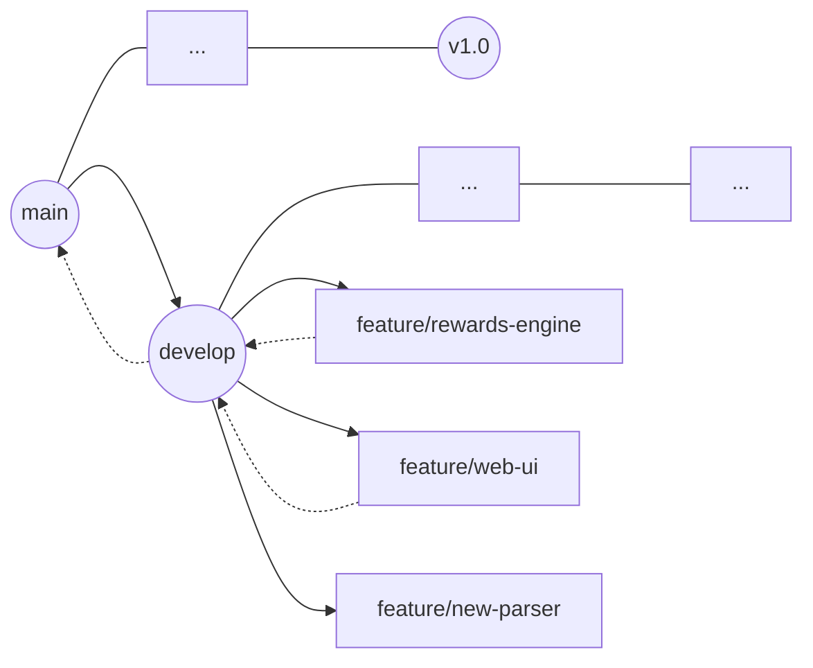

# Git Branching Strategy & Visualization

## 1. 概念圖示 (Tree Visualization)

雖然 Git 本身是「有向無環圖 (DAG)」，但你可以把它想像成一棵樹或魚骨圖：

### 分支角色說明：
*   **`main` (主骨架)**: 
    *   **狀態**: 絕對穩定。
    *   **用途**: 只存放「已驗證、可直接執行」的程式碼。通常只有在 `develop` 測試完全沒問題後，才會合併回 `main`。
*   **`develop` (成長中的軀幹)**:
    *   **狀態**: 開發中，可能會有小 Bug，但基本結構完整。
    *   **用途**: 作為所有新功能的「集合地」。你在這裡整合各個 feature 分支。
*   **`feature/*` (側邊的小刺/分支)**:
    *   **狀態**: 實驗性、開發中。
    *   **用途**: 每一根「小刺」只做一件事（例如：實作 CUBE 卡回饋邏輯）。做完並測試通過後，就合併回 `develop` 並刪除該分支。

## 2. 管理流程 (Workflow)

當你要開始一個新功能時（例如：改善 Web UI）：

1.  **切換到 `develop`**：確保你是從最新的開發進度開始。
2.  **開新分支**：`git checkout -b feature/web-ui`。
3.  **盡情開發**：在分支裡隨便改，不用怕壞掉。
4.  **對比驗證**：遵循我們 `GEMINI.md` 裡的「雙軌驗證」。
5.  **合併回 `develop`**：驗證無誤後，併入 `develop`。

## 3. 工具推薦：管理圖示

如果你需要「看得到」的分支管理圖示，不需要手畫魚骨圖，有幾個推薦工具：

1.  **VS Code 擴充套件: `Git Graph` (強烈推薦)**:
    *   它會直接在 VS Code 裡畫出漂亮的彩色線條圖，讓你一眼看出哪個分支是從哪裡分出來的，哪裡合併了。
2.  **GitKraken 或 GitHub Desktop**:
    *   視覺化的 Git 客戶端，介面非常直覺。
3.  **指令介面 (CLI)**:
    *   輸入 `git log --graph --oneline --all`，我也能在文字介面幫你看圖。

## 4. 這樣對你有什麼幫助？

*   **平行作業**: 你可以現在在 `feature/rewards` 寫 Python 邏輯，如果突然想改 `index.html` 的樣式，就切到 `feature/web-ui`。兩邊的程式碼不會互相干擾。
*   **安全性**: 如果 `feature/rewards` 寫到一半發現架構想錯了，你可以直接放棄那個分支回到 `develop` 重新開始，完全不影響原本能跑的程式。

**你覺得這樣的圖示與角色定義，符合你對專案管理的期待嗎？** 如果確認要執行，下一步我可以幫你先整理目前的變更並建立出 `develop` 分支。
