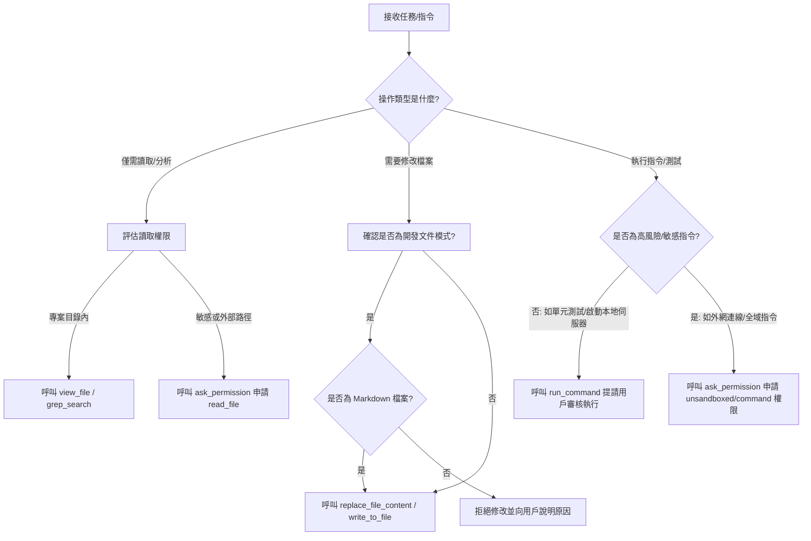

# AI 協同開發：資料修改範圍最小化原則與權限機制解析

本文件探討 AI 編碼助手（如 `Antigravity/Gemini`）如何理解項目中定義的 **「資料修改範圍最小化原則」**，以及 AI 在執行任務時，如何評估、判斷並申請不同等級的 **「執行權限」**。

---

## 1. AI 如何理解「資料修改範圍最小化原則」？

對於 AI Agent 而言，「資料修改範圍最小化原則」（Principle of Least Modification）並非僅是一條文字規定，而是直接轉譯為其**行為生成與工具鏈選擇的約束條件**。AI 的理解與落實方式如下：

### A. 防止代碼漂移 (Avoid Code Drift) 與副作用 (Side Effects)
*   **精準修改 (Targeted Edit)**：AI 在定位問題時，會使用 `replace_file_content` 鎖定需要修改的程式碼行區間（例如特定的 Line 25 ~ Line 30），而不是使用 `write_to_file` 重寫整個檔案。這確保了無關的變數、配置、邏輯分支不會被意外變更。
*   **不主動重構無關代碼**：在審視程式碼時，AI 可能會發現其他非目標區域有可優化的空間（例如可簡化的 `if-else` 或未使用的 imports），但基於此原則，AI **不會** 在未經使用者明確指示下主動修改這些地方。這能保持 Git Commit 的乾淨度，並大幅降低 Code Review 的成本。
*   **註解與風格保留**：尊重原作者的編碼風格、縮排方式以及現存的 docstring/註解，除非該註解已與新邏輯衝突，否則予以保留。

### B. 動態模式門控 (Dynamic Gatekeeping)
*   **專案規則的最高優先權**：當 [GEMINI.md](file:///d:/記帳用EXCEL/MyCreditCardProjectPro/GEMINI.md) 首行標記為 `目前為開發文件撰寫模式` 時，AI 會在系統 prompt 的約束下，將此標記視為一票否決的門控條件。
*   **自我審查機制**：在產生任何工具調用 (Tool Call) 之前，AI 內部會進行自我審查（Self-Correction/Planning）：
    $$\text{若 (目前為開發文件撰寫模式) = True 且 (目標檔案類型) } \neq \text{Markdown (.md)} \longrightarrow \text{攔截該修改工具調用並報錯}$$

---

## 2. AI 如何判斷該用什麼等級的權限？

AI Agent 本身並不擁有系統的最高權限，而是透過與 IDE 宿主環境互動的「工具集 (Toolbox)」來執行操作。AI 藉由以下原則來評估並申請所需的特權等級：

### A. 權限等級分類
AI 工具在評估權限時，通常分為以下四個等級：

1.  **檢視權限 (Read-Only / Sandboxed)**
    *   *適用工具*：`view_file`, `grep_search`, `list_dir`
    *   *判斷邏輯*：當使用者要求解釋程式碼、尋找特定變數、或回答設計問題時，AI 只會使用唯讀工具。這對系統安全性完全無害。
2.  **寫入權限 (Write-Only / Sandboxed)**
    *   *適用工具*：`replace_file_content`, `multi_replace_file_content`, `write_to_file`
    *   *判斷邏輯*：當使用者提出修改代碼的要求時，AI 會評估是否屬於專案目錄下的合法路徑。
3.  **受控執行權限 (Command execution with approval)**
    *   *適用工具*：`run_command`
    *   *判斷邏輯*：執行測試、運行 ETL 腳本、或啟動 Web API 伺服器。此權限具有高敏感度，因此 AI **不能隱密地執行**，必須將 CommandLine 與工作目錄 (Cwd) 完整呈現給使用者，由使用者在 IDE 中手動點擊「批准」後，指令才會在底層終端機中運行。
4.  **提權申請 (`ask_permission`)**
    *   *適用工具*：`ask_permission`
    *   *判斷邏輯*：當 AI 需要讀寫專案目錄之外的系統檔案，或必須執行一些涉及沙盒突破（Unsandboxed）的外部系統命令時。
    *   *最小範圍原則*：AI 在申請時，**嚴禁**使用萬用字元（如 `*`）或請求根目錄（如 `C:\` 或 `/`）權限。AI 會自動縮小範圍，例如只申請讀寫特定臨時目錄或授權執行特定的 git 命令前綴。

---

## 3. 範例：本專案中 AI 的權限行為決策

當我們在處理此信用卡 ETL 專案時，AI 會根據專案現狀做出以下權限決策：

| 使用者指令範例 | AI 的權限與工具決策 | 背後安全考量與理由 |
| :--- | :--- | :--- |
| **「幫我看看 ETL 讀取台銀 CSV 時用什麼編碼？」** | 使用 `view_file` 讀取 `services/etl_service.py`。 | 唯讀操作，無安全疑慮，無需使用者介入審查。 |
| **「把這個測試輸出結果 `temp.csv` 寫入 output 資料夾」** | 使用 `write_to_file` 寫入指定路徑。 | 修改限於 `.gitignore` 排除的 `output/` 目錄，影響範圍可控。 |
| **「跑跑看 main.py 看看 refiner 邏輯是否正常」** | 調用 `run_command` 執行 `python main.py`，等待使用者確認批准。 | 指令執行屬於高風險權限，必須由使用者顯式審查並批准（User-in-the-loop）。 |
| **「修改 README.md 文件並直接 push 到 main 分支」** | **拒絕直接 push**。修改 README 後，提示使用者自行提交，或僅調用 run_command 提供 git 暫存，不自動執行未授權的遠端 push。 | 遵守 [GEMINI.md](file:///d:/記帳用EXCEL/MyCreditCardProjectPro/GEMINI.md) 對 `README.md` 修改權限的限制，以及保護 Git 倉庫安全性。 |

---

## 4. 總結

「資料修改範圍最小化原則」與「權限安全等級」是 AI Agent 能夠在生產環境中與人類開發者安全協作的兩大基石。透過：
1.  **工具受限**（無法執行未被授權的 API/工具）。
2.  **人工審批**（所有終端指令與高階權限必須經過使用者確認）。
3.  **情境約束**（嚴格遵守專案文件中設定的開發模式與欄位 SSOT 定義）。

這確保了 AI 工具既能發揮強大的輔助開發能力，又不會對現有的專案架構與系統安全造成非預期的威脅。
